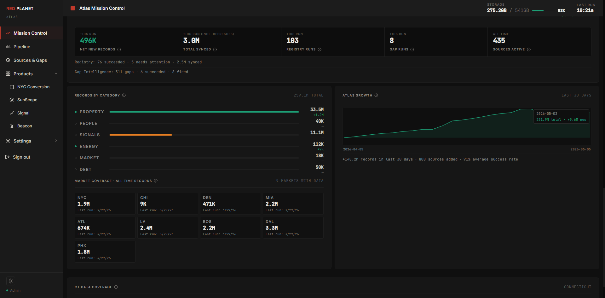

# The Data Asset

Atlas is built around a single principle — the most valuable data is the data nobody else has. Not aggregated feeds. Not licensed vendor content. Proprietary records sourced, normalized, and maintained by the engine itself, growing autonomously every night. As of **2026-05-04 19:45 UTC**, Atlas holds **249,263,871** verified records across **447** active sources.

## Property & Parcel Data

The foundation of Atlas is parcel-level property data covering ownership, assessed value, land use classification, building characteristics, and geographic identifiers. This is the anchor layer — everything else in Atlas joins back to a parcel.

## Transaction Data

Sales history, transfer dates, consideration amounts, and deed types tracked continuously. Transaction history is what turns a static property record into a dynamic asset — it shows how a market moves, where capital is flowing, and which assets are changing hands.

## Signals

Signals are the intelligence layer — computed indicators that surface patterns, anomalies, and opportunities that raw records alone cannot reveal. Distress signals, equity indicators, market velocity signals, and ownership pattern flags are generated automatically as new data flows into the engine.

## Distress & Filing Data

**127,678** distress filings tracked across lis pendens, foreclosure activity, tax delinquency, and related court records. **17,856** distress signals generated from that filing activity. This is among the most time-sensitive data in Atlas — distress events move fast and the engine is designed to capture them as they happen.

## Commercial & Permit Data

Building permits, commercial fundamentals, CMBS data, and CRE transaction activity feeding a separate layer purpose-built for institutional real estate intelligence.

## Data Quality

Not all data is equal. Atlas maintains a four-tier quality classification across all records, evaluated automatically as part of the ingestion pipeline and continuously re-evaluated as new corroborating data arrives:

- Verified: **5,067,015** records — highest confidence, multiple source confirmation
- Usable: **8,319,354** records — reliable, single source verified
- Review: **8,487,948** records — ingested, pending additional verification
- Unreliable: **1,125,152** records — flagged, excluded from primary queries

---

*All figures current as of 2026-05-04 19:45 UTC. Atlas ingests new data nightly — record counts update automatically.*
