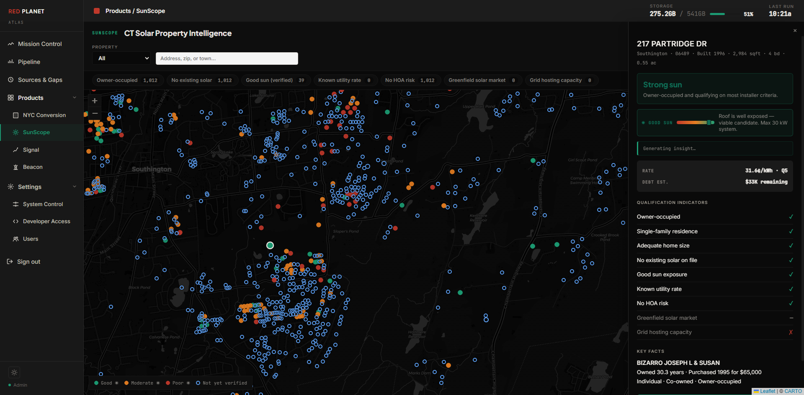

# The Platform Model & Product Velocity

Atlas is infrastructure. It is not a product with a fixed interface, a fixed dataset, or a fixed use case. It is a platform that any application can be built on top of — by Red Planet, by third parties, or by clients themselves.

This is a fundamental distinction from how legacy data providers operate. CoStar, ATTOM, and CoreLogic deliver a product. You access it through their interface, on their terms, with their data model. If it doesn't fit your use case you adapt to it. There is no alternative.

Atlas inverts that model entirely.

## How the Platform Works

Atlas sits at the foundation. On top of it anything can be built — a consumer-facing application, an institutional analytics tool, an automated underwriting engine, a market intelligence dashboard, a lead generation platform. The data is the same. The intelligence layer is the same. The application layer is fully customizable.

Red Planet builds its own products on Atlas. Third parties can build on Atlas. Clients can access Atlas directly through the API and build whatever they need internally. The platform does not dictate the use case — the use case dictates how the platform is used.

## Why This Model Wins

Legacy providers built vertically — they own the data, the interface, and the relationship. That creates lock-in but it also creates a ceiling. Their product can only be as good as their roadmap allows.

Atlas is horizontal. The data asset grows continuously. The intelligence layer improves automatically. Any application built on top of it inherits those improvements without rebuilding anything. As Atlas gets better everything built on it gets better.

## API First

Every data layer in Atlas is accessible via API. Property records, transaction history, signals, distress data, scores — all queryable programmatically. This is what makes the platform model real rather than theoretical. A client does not need to use a Red Planet interface. They call the API and build whatever they need.

## The Commercial Implication

A single data asset can power an unlimited number of applications across an unlimited number of markets and use cases. The marginal cost of adding a new product or a new client on top of existing infrastructure is low. That is the commercial leverage of owning the platform rather than the product.

## Product Velocity

The platform model has a second consequence that matters as much as the first. With Atlas as the foundation and AI as the development tool, new products and applications can be built in days rather than months. The bottleneck is not the technology — it is identifying the right market and the right use case. This changes the economics of product development fundamentally.

Traditional data product development requires assembling the data, cleaning it, normalizing it, building the infrastructure to store and query it, and then building the application on top. That process takes months and significant capital before a single line of product code is written.

With Atlas that entire first phase is already done. The data exists, it is normalized, it is queryable, and it is continuously improving. Product development starts at the application layer — which with AI-assisted development tools means a working prototype can exist within days of identifying a use case.

## Real Examples

Atlas has already demonstrated this velocity across multiple verticals:

**NYC Office Conversion Intelligence** — **1,683** Manhattan office buildings scored across conversion viability, zoning compatibility, debt distress, and market absorption. A product that would have taken a legacy data company months to build and price out of reach for most clients.

**CT Solar Intelligence** — Properties scored across solar potential, roof characteristics, utility rates, and incentive eligibility. A complete solar lead intelligence product built on existing Atlas parcel and climate data.

**Distress Intelligence** — Homeowner and commercial distress signals surfaced from filing activity, tax delinquency, and ownership patterns. A product serving nonprofit housing counselors and institutional investors simultaneously from the same underlying data.

*SunScope — CT Solar Property Intelligence, built on Atlas data*

## The Implication for New Markets

Every new market Atlas enters — whether geographic or vertical — immediately unlocks new product possibilities. The data infrastructure does not need to be rebuilt. The intelligence layer does not need to be redesigned. A new scoring model, a new signal category, a new API endpoint — and a new product exists.

This is what it means to own the platform rather than the product. The asset compounds. Every improvement to Atlas makes every product built on it better, and every new product validates the platform for the next one. Today Atlas holds **249,263,871** verified records across **447** active sources — and every one of them is available to any product built on the platform.

---

*All figures current as of 2026-05-04 22:24 UTC. Atlas ingests new data nightly — record counts update automatically.*
