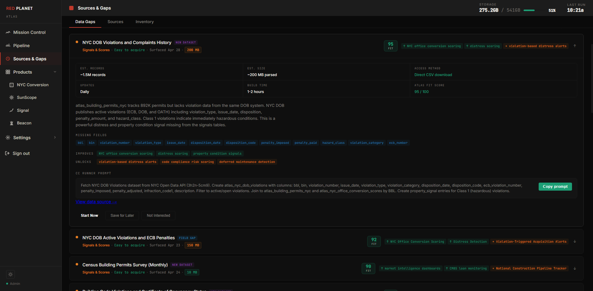

# Data Quality, Verification & Where We're Going

At the scale Atlas operates, data quality is not a feature — it is an operational requirement. A record that cannot be trusted is worse than no record at all. Atlas is built around this principle from the ground up. As of **2026-05-05 13:03 UTC**, Atlas holds **259,053,764** verified records across **447** active sources, with quality classification applied across the core property and parcel layer.

*Atlas Sources & Gaps — automated gap discovery with fit scoring and acquisition recommendations*

## The Four-Tier System

Every record in Atlas carries a quality classification. The system is automatic — records are evaluated at ingestion and re-evaluated continuously as new corroborating data arrives.

Verified — **5,067,015** records. Highest confidence. Record has been confirmed across multiple independent sources. These records are the foundation of any signal or score derived from Atlas data.

Usable — **8,319,354** records. Reliable single-source records that have passed internal consistency checks. The majority of Atlas data sits in this tier.

Review — **8,487,948** records. Ingested but not yet fully validated. These records are accessible but flagged. Signal generation does not run against Review tier records until they are promoted.

Unreliable — **1,125,152** records. Records that have failed consistency checks or cannot be corroborated. Excluded from primary queries and signal generation. Retained for audit purposes.

## Source Reliability Weighting

Not all sources are equal. Atlas tracks the historical reliability of every data source — how often it produces clean records, how frequently it changes, and how well it corroborates against other sources. Source reliability feeds directly into quality tier assignment. A record from a consistently reliable source starts with a higher baseline confidence than one from a newly discovered or historically inconsistent source.

## Continuous Re-evaluation

Quality classification is not a one-time event. As new data arrives — new transactions, new filings, new ownership records — existing records are re-evaluated against the expanded dataset. A record that was Usable when first ingested may be promoted to Verified when a second independent source corroborates it. A record that appeared clean may be downgraded when contradictory data surfaces.

This continuous re-evaluation is what keeps the quality of a rapidly growing dataset from degrading over time as new sources and data are added.

## What This Means for Derived Intelligence

Signal generation and scoring run only against Verified and Usable tier records — by design. The intelligence Atlas produces is only as good as the data it runs against, and that floor is enforced automatically.

## Where We're Going

Atlas is not a finished product. It is a continuously evolving platform with a clear trajectory — deeper data, broader coverage, more sophisticated intelligence, and an expanding ecosystem of applications built on top of it. The quality floor described above is what makes that trajectory meaningful: scale without trust is noise, and Atlas is designed so that scaling never compromises trust.

## Scale

The immediate priority is scale. Atlas is on a path to one billion verified records. That milestone is not aspirational — it is an engineering target with a defined timeline, driven by expanding source coverage, increased ingestion concurrency, and infrastructure built for sustained high-volume ingestion.

At one billion records Atlas becomes a data asset of a different category entirely — one that competes directly with the largest institutional data providers in the world, at a fraction of their cost structure.

## Geographic Expansion

Current coverage is concentrated in high-activity markets. The roadmap expands that systematically — deeper coverage in existing markets first, then expansion into undercovered geographies where the data gap is largest and the commercial opportunity is clearest. Every new market added to Atlas immediately unlocks new product possibilities on top of it.

## Intelligence Depth

The signal layer is still early. As the underlying data asset grows the intelligence that can be derived from it expands proportionally. New signal categories, more sophisticated scoring models, entity-level intelligence that connects ownership patterns across markets and asset classes — these are the next layer of what Atlas becomes as the data matures.

## The Platform Ecosystem

Red Planet builds on Atlas. The roadmap includes third party developers and clients building on Atlas directly — through the API, through white label arrangements, through data licensing. The platform model only becomes more valuable as more applications are built on top of it and the data asset continues to grow beneath them.

## The Competitive Position

Legacy data providers are expensive, rigid, and slow to change. They are built on infrastructure and business models designed for a world before autonomous data engineering and AI-assisted development existed. That world is not coming back.

Atlas is built for what comes next. The data asset grows autonomously. The intelligence layer improves continuously. The development model allows new products to be built faster than any traditional organization can respond. That is a durable competitive position — and it compounds over time.

---

*All figures current as of 2026-05-05 13:47 UTC. Atlas ingests new data nightly — record counts update automatically.*
